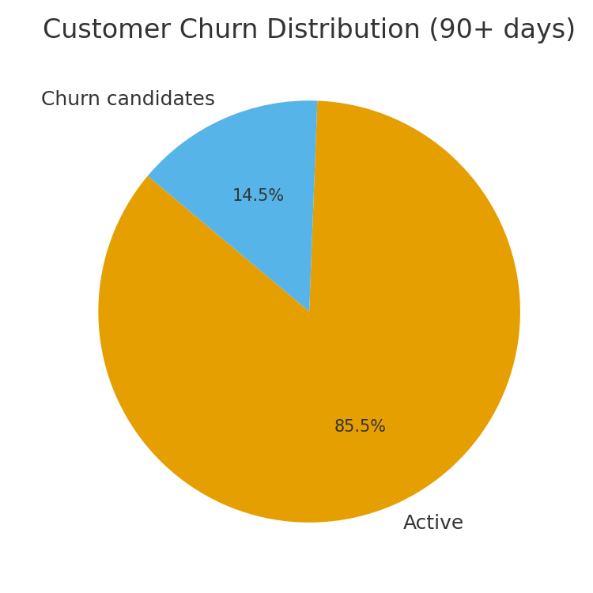

# E-commerce Analytics & Retention — Client-Grade Project

**Author:** Uzain Mohid  
**Stack:** Python, SQL (SQLite), Tableau Public

This repository simulates a real client engagement for a US e-commerce brand. It includes synthetic but realistic data (100k+ rows), business-ready SQL, RFM + churn analysis in Python, and a Tableau dashboard with actionable insights.

## Quickstart
```bash
# 1) Create virtual environment
python -m venv .venv
# Windows
.venv\Scripts\activate
# macOS/Linux
source .venv/bin/activate

# 2) Install dependencies
pip install -r requirements.txt

# 3) Generate realistic data
python src/generate_data.py

# 4) Load to SQLite
python src/load_to_sqlite.py

# 5) Prepare exports for Tableau
python src/prepare_tableau_exports.py
```


## Repository Layout
```
data/
  raw/         # generated CSVs
  db/          # ecom.db (SQLite)
  processed/   # exports for Tableau
notebooks/     # optional EDA notebook(s)
src/           # ETL and feature engineering scripts
sql_queries/   # business SQL
dashboard/     # tableau assets / screenshots
report/        # executive summary
```

## 📸 Dashboard Previews

1. **Monthly Revenue Trend**  
   

2. **Revenue by Category**  
   

3. **Customer Churn Risk**  
   

4. **Top 10 Customers by Revenue**  
   


## Business Questions
1) MoM revenue & order trends.  
2) Top categories and products (Pareto 80/20).  
3) Churn candidates (no purchase in 90 days).  
4) Geo performance and channel mix.

## Executive Summary
See `report/Executive_Summary.md` for insights and recommendations.

## License
MIT